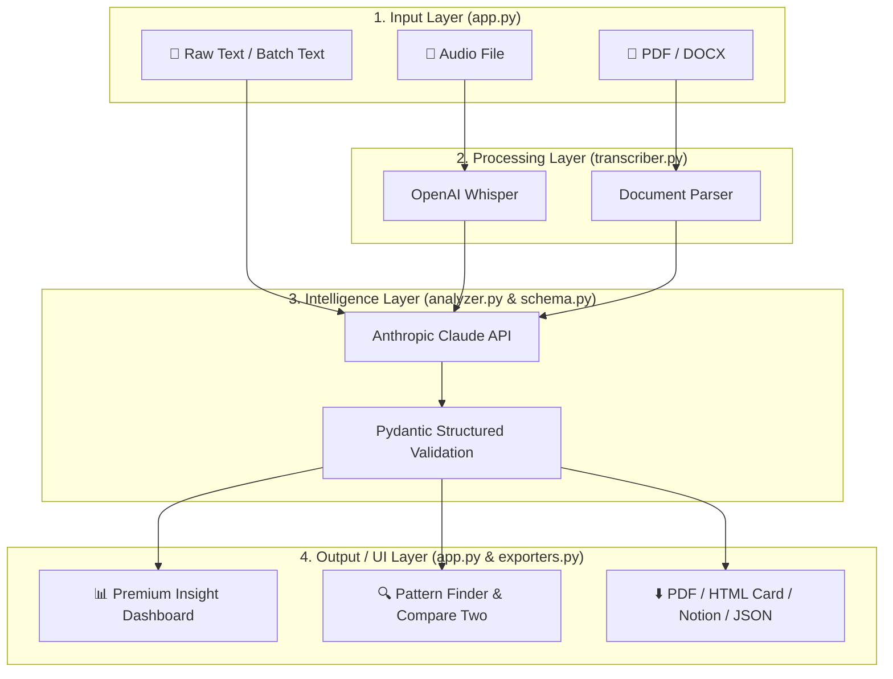

# 🎙️ PM User Research Engine

[](.github/workflows/ci.yml)
[](https://anthropic.com)
[](https://openai.com/whisper)
[](https://python.org)
[](LICENSE)

> A suite of AI tools that automate the full user research lifecycle — from raw audio and transcripts to structured insights, cross-interview patterns, and PM-ready action items. Built for Google-PM-level user obsession.

---

## 🗂️ Tools in this suite

| Tool | Port | Status |
|---|---|---|
| [Interview Transcript Summarizer](interview_summarizer/) | 8501 | ✅ v1.0 |
| Persona Builder from Usage Data | 8502 | 🔜 Coming |
| User Pain Point Clusterer | 8503 | 🔜 Coming |
| NPS Response Categorizer | 8504 | 🔜 Coming |
| Interview Recruitment Screener | 8505 | 🔜 Coming |

---

## 🎙️ Interview Transcript Summarizer

Transforms a raw 60-minute interview (audio, PDF, DOCX, or pasted text) into a fully structured insight document in under 60 seconds.

### What it extracts

| Section | Details |
|---|---|
| **Pain Points** | Severity-rated with direct quotes and frequency |
| **Motivations** | With underlying psychological driver |
| **Unmet Needs** | With current workaround and opportunity size |
| **JTBD Statements** | Canonical "When I / I want to / So I can" format |
| **Persona Signals** | Behavioral dimensions observed in the interview |
| **Sentiment Map** | Per-topic sentiment with intensity and quotes |
| **Notable Quotes** | Verbatim with context and product significance |
| **Follow-up Questions** | Must ask vs Nice to have, with rationale |
| **PM Actions** | P0/P1/P2 by category (Roadmap/Research/Design/Stakeholder) |

### Analysis modes
- **Single interview** — full deep-dive analysis
- **Batch mode** — upload multiple .txt files, analyze all at once
- **Side-by-side compare** — two interviews compared directly
- **Cross-interview patterns** — Claude synthesizes themes across all analyzed interviews

### Input formats
- 🎵 Audio (mp3, mp4, wav, m4a, webm) — transcribed via OpenAI Whisper
- 📄 PDF transcript
- 📋 DOCX transcript
- 📝 Pasted text

### Export formats
- 📑 PDF (structured insight report)
- 🃏 Research Card (shareable HTML one-pager)
- 🗒️ Notion (push directly to your research database)
- 📄 JSON (machine-readable for downstream tools)

---

## 🚀 Quickstart

```bash
git clone https://github.com/suriyaethiraj/pm-user-research-engine.git
cd pm-user-research-engine
python -m venv venv && source venv/bin/activate
pip install -r requirements.txt
export ANTHROPIC_API_KEY="sk-ant-..."
export OPENAI_API_KEY="sk-..."   # only needed for audio transcription

streamlit run interview_summarizer/app.py
```

### Docker
```bash
cp .env.example .env
docker-compose up
# → localhost:8501
```

---

## 🔗 Notion setup

1. Go to [notion.so/my-integrations](https://notion.so/my-integrations) → Create integration
2. Copy the **Internal Integration Token**
3. Create a Notion database → Share it with your integration
4. Copy the **Database ID** from the URL
5. Paste both into the app sidebar

---

## 📐 Architecture & Workflow

### End-to-End Workflow


### Directory Structure
```
interview_summarizer/
├── app.py          ← 5-tab Streamlit UI (Dashboard, Library, Compare, Batch, Patterns)
├── transcriber.py  ← OpenAI Whisper audio + PDF/DOCX file extraction
├── analyzer.py     ← Claude single-interview + cross-pattern analysis engine
├── exporters.py    ← PDF generation, HTML research card, Notion sync, JSON export
├── schema.py       ← Pydantic models enforcing rigid data schemas
└── evals.py        ← Automated quality benchmarking script
```

---

## 🧪 Evaluation

```bash
cd interview_summarizer
python evals.py
```

Checks: Schema validity · Pain points with quotes · JTBD format · PM action priorities · Follow-up questions · Notable quotes verbatim · Cross-interview pattern synthesis

---

## 🔮 Roadmap (v2.0)

- [ ] Persona Builder from behavioral usage data (#32)
- [ ] Pain Point Clusterer with FAISS semantic grouping (#34)
- [ ] NPS Response Categorizer with trend tracking (#35)
- [ ] Interview Recruitment Screener (#37)
- [ ] Research repository with searchable insight database
- [ ] Affinity diagram auto-generation from batch interviews

---

## 📄 License

MIT — see [LICENSE](LICENSE)
